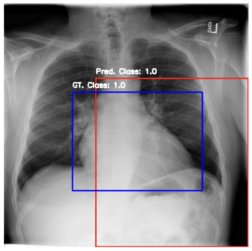
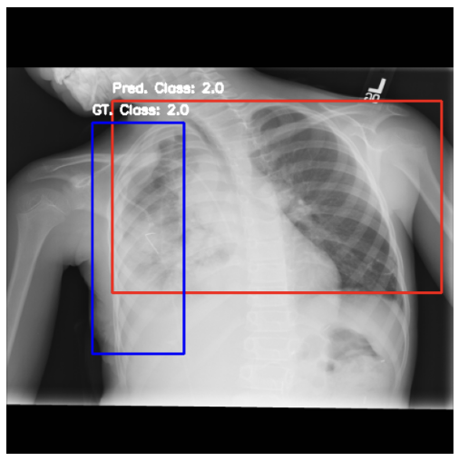
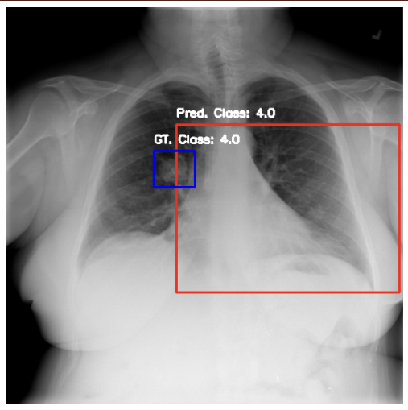
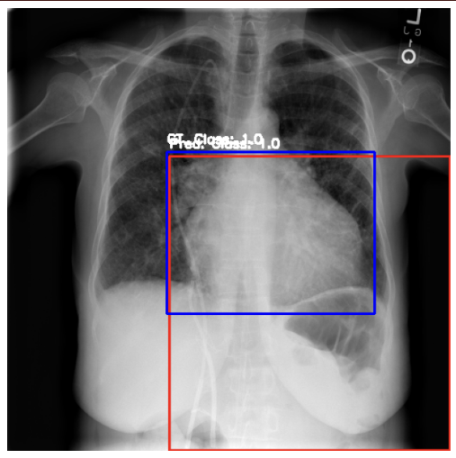
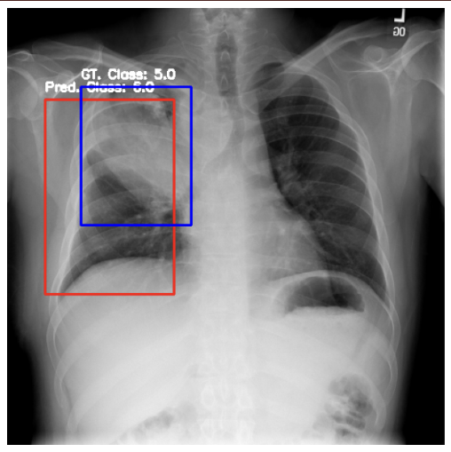

## NIH Chest X-ray disease detector

  This repository contains a pipeline for training a multi-class detection model (7 classes) for the task of detecting various diseases in chest X-rays.
  Dataset link: https://nihcc.app.box.com/v/ChestXray-NIHCC/folder/36938765345
  

Tools used:

 - Pytorch, Pytorch-lightning, Numpy, Hydra, MlFlow, Albumentations (check requirements.txt)
 - For training I chose EfficientDet model (https://github.com/rwightman/efficientdet-pytorch).
 - In Data_exploration.ipynb - jyputer notebook with EDA


## Example output results







The results are not perfect, but we can see that the model has begun to understand the concepts. 

## During training optimized:

 - Focal loss:  for disbalanced classes better optimization

 - bbox_loss: optimizes distance between bboxes

Validation is done on 15 percent of the dataset using the mAP metric.

To start training:

```
python train.py --config-name config.yaml
```

It is better to make new config file for every experiment for better logging and reproducibility.

## Metrics: 
At the end of the training we evaluate the model and calculate sensitivity specificity metrics. Sensitivity and specificity are particularly suitable for medical data because they provide crucial insights into the performance of diagnostic tests or models, which is very important for making informed medical decisions.

  
**High Sensitivity**: A test with high sensitivity correctly identifies most of the patients who have the disease. This is crucial in medical scenarios where missing a positive case (false negative) could lead to serious consequences, such as delayed treatment or disease progression.

**High Specificity**: A test with high specificity correctly identifies most of the patients who do not have the disease. This is important to avoid unnecessary treatments, anxiety, and further invasive diagnostic procedures.

## Evaluation 
You can evaluate the model with the eval.py script
example:

```
python eval.py --image_folder_path /path/to/images --annotations_file /path/to/annotations.csv --checkpoint /path/to/checkpoint --cm_threshold 0.3 --num_classes 7 --image_size 512 --architecture tf_efficientdet_lite3 --backbone efficientnet_b0
```

now metrics are
 - Sensitivity: 0.5537: This means that approximately 55.37% of the actual positives are correctly identified by the model.
 - Specificity: 0.4444:  A specificity of 44.44% means that the model correctly identifies about 44.44% of the healthy patients.

While a sensitivity of 55.37% is better than random guessing, it is generally not sufficient for medical applications, especially in cases where it is critical to identify as many positive cases as possible.

A specificity of 44.44% is quite low, suggesting that the model is generating a high number of false positives, which can lead to unnecessary follow-up procedures and treatments.

As we can see from the current sensitivity and specificity values, this model has significant potential for improvement.


## How can the current pipelines be improved:

1) 2-stage training: Pre-train the backbone on the same dataset for the classification task and then train detection.

2) Experiment with Different Configurations: Try other EfficientDet configurations (there are more than 50 of them) or other models (DETR, Detectron, YOLO). Also, experiment with different image sizes.

3) Extend the Dataset: Use additional data from other datasets and label more images for rare classes. Training a good detector on 800 images for 8 classes is challenging. Also we can try to generate synthetic data.

4) Develop Better Augmentations: Experiment with a variety of augmentations. So far, only the most basic augmentations have been used.

5) Hyperparameter Tuning: Experiment with different hyperparameters to optimize the model.

6) Use special Pre-trained Models: Find pre-trained detectors on other medical data and use them as a starting point.

7) Try some special techniques like: EMA, SWA, Mixup/Cutmix augmentations

